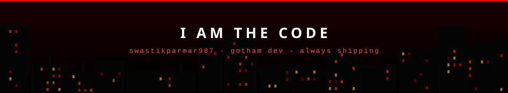

  

> *"It's not who I am underneath, but what I do that defines me."* — Bruce Wayne

 

<table>
<tr>
<td width="50%" valign="top">

### 🦇 HalluciGuard
AI-powered **LLM security firewall**. Guards against hallucinated and unsafe outputs.  
  

</td>
<td width="50%" valign="top">

### 🦇 StudySync
**SaaS study-partner platform** for students. Next.js, TypeScript, Tailwind and Supabase.  
  

</td>
</tr>
<tr>
<td width="50%" valign="top">

### 🦇 Orbis.AI
**AI Confidence vs. Accuracy Tracker**. How sure a model is vs. how right it is.  
 

</td>
<td width="50%" valign="top">

### 🦇 Ultimate Toolbox
**Docker-hosted, privacy-first** tools app. A browser app built around 1000+ tools.  
 

</td>
</tr>
<tr>
<td width="50%" valign="top">

### 🦇 Personal AI Agent
**WhatsApp-triggered** automation agent. Built on n8n to handle tasks for me.  
  

</td>
<td width="50%" valign="top">

### 🦇 AI Web Scraper
**Hybrid crawler + LLM extraction**. Pulls structured data from messy pages.  
 

</td>
</tr>
<tr>
<td width="50%" valign="top">

### 🦇 Resume Generator
**n8n workflow:** AI to LaTeX to PDF. A fully automated resume pipeline.  
  

</td>
<td width="50%" valign="top">

### 🦇 Video Attendance
**CCTV/RTSP face-recognition** attendance. Built for a university competition.  
 

</td>
</tr>
</table>

 

 

  

 

**🐍 Snake eating my commits**

<picture>
  <source media="(prefers-color-scheme: dark)" srcset="https://raw.githubusercontent.com/swastikparmar987/swastikparmar987/snake-output/github-snake-dark.svg" />
  
</picture>

 

**👻 Pac-Man vs the ghosts, on my contribution graph**

<picture>
  <source media="(prefers-color-scheme: dark)" srcset="https://raw.githubusercontent.com/swastikparmar987/swastikparmar987/output/pacman-contribution-graph-dark.svg">
  <source media="(prefers-color-scheme: light)" srcset="https://raw.githubusercontent.com/swastikparmar987/swastikparmar987/output/pacman-contribution-graph.svg">
  
</picture>

 

